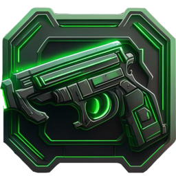

<div align="center">

# 🔫GunStore🔫

My coursework using C++ and a framework QT
  

  
</div>

## Description
```text
My first project using QT framework and at the same time 3rd year college course project.
MySQL was chosen as the database management system.
The theme of this course project is "weapons store".
````

## 🎆Design

### 🔑Authorization
<div align="center">  </div>

### 🖼️Main window
#### ⭐Admin


#### 🙎‍♂️Cashier


## Project Configuration
1. You need to run the database creation script "createBD/GunStore.sql"
2. Run the script for filling the database with initial data "createBD/InsertGunStore.sql"
3. Run the procedure creation script "createBD/procedurAndFunction.sql"
4. Run script to create roles and user "createBD/CreatUser.sql"
5. After that, we launch applications from the account of the created user, or from root